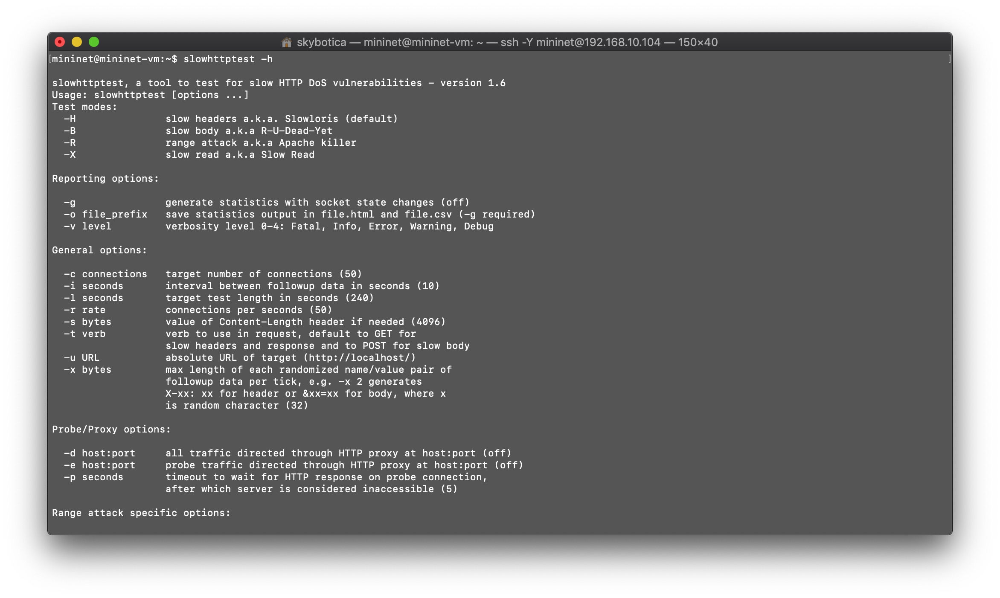
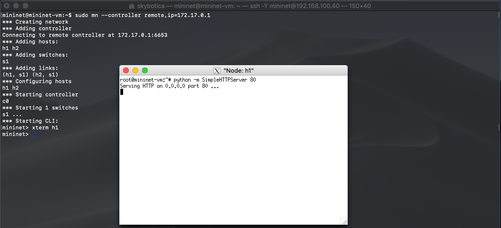
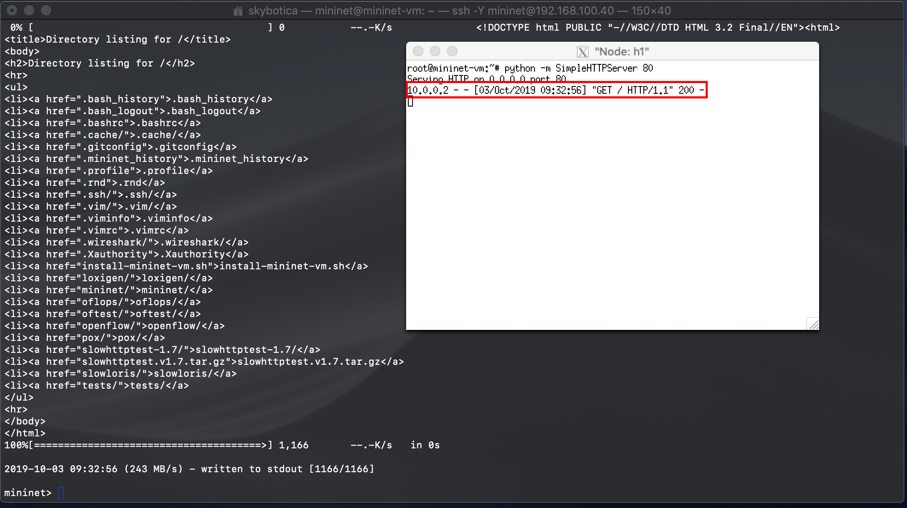
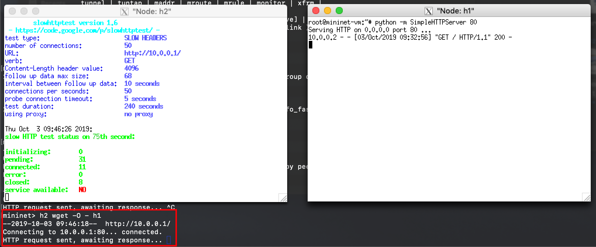

# Attack ONOS

This tutorial will focus on attacking the ONOS SDN controller that was previously configured with the [installation tutorial](./INSTALL.md). We will use the following attacks:
- Slow HTTP Headers (Slowloris)
- Slow HTTP Post (R-U-Dead-Yet or RUDY)
- Slow Read Attack
- Apache Killer (Range) Attack.

As you may notice this attacks are all based on application level using HTTP to attack a server. This tutorial will focus on running and understanding the attacks, but not on the implementation of the attacks. We will use a denial of service attack simulator called [slowhttptest](https://linux.die.net/man/1/slowhttptest) it is a CLI that already has implemented this attacks so we can run them with ease.

## Requirements

- An already configured mininet VM in virtual box, if you haven't setup your VM you can check a tutorial on how to do it on the SDN wiki [here](http://sdn.wikidot.com/setting-up))
- The mininet VM should have access to internet
- ONOS controller running, if you haven't installed it yet you can check our previous tutorial [here](./INSTALL.md).

## Install slowhttptest

To install the CLI just run the following command:

`sudo apt-get install slowhttptest`

To verify if the installation was successful run:

`slowhttptest -h`

And you should see the documentation of the CLI.

As you can see this command allow us to run attacks in 4 modes, each of those with the 4 attacks that we will test. Below is the list of the attacks following with its proper flag that need to be passed to the CLI.

- Slowloris (default): -H
- R-U-Dead-Yet or Rudy: -B
- Apache killer: -R
- Slow Read: -X

## Setting up an attack

### 1. SSHing into mininet:

If you are using macOS or linux you need to ssh using the -Y flag, like in the following command.

`ssh -Y mininet@<MININET_IP>`

With <MININET_IP> being your vm ip, this is to enable mininet to open terminal emulators for the hosts in our mininet topology.

### 2. Run topology:

Before running our topology, double check if you have the ONOS container running to do that you can run `sudo docker ps` to check the running containers if you can't see any running container. You should run `sudo docker ps -a` which will show you all the containers including the stopped ones. You can resume a stopped container by running `sudo docker start <CONTAINER_ID>` you can obtain the CONTAINER_ID of the ONOS container from the previous command. Below is an image showing the process.

In order to run an attack we need to setup our topology with a http server to attack. To do that please run the following commands:

- `sudo mn --controller remote,ip=<ONOS_IP>` this will run a simple topology with 2 hosts, 1 switch and it will connect to the ONOS controller with the ONOS_IP. You can get the ONOS controller ip from the ONOS UI.
- `xterm h1` this will open an emulated terminal for the host 1, which will be our http server.
- On the h1 terminal run `python -m SimpleHTTPServer 80` this will setup a simple http server on the host 1 that will listen on the port 80.

Then you can do a request to that server by running `h2 wget -O - h1` on mininet terminal and you should see something like this:

And we are ready to do some attacks!

## Running an attack

In order to start the attack from host 2 we need to open a new emulated terminal by running `xterm h2`, on this new terminal we will run the default attack (Slowloris) using the slowhttptest CLI we previously installed. 

You can run the Slowloris attack by running `slowhttptest -u <URL_TO_ATTACK>`. We will attack h1, thus the url would be `http://<H1_IP>`, which can be obtained by running `h1 ip addr` in our case it is 10.0.0.1, thus our url would be http://10.0.0.1, so the full command to run from the h2 terminal would be `slowhttptest -u http://10.0.0.1`.

After running the attack we can try a request to host 1 http server by running `h2 wget -O - h1` on the mininet terminal. The request will be blocked because the attack was successful.

To run the other attacks you just add the respective flags that were explained on the [Install slowhttptest](#install-slowhttptest) section. Below is the list with the full commands.

- Slowloris (default): `slowhttptest -H -u http://10.0.0.1`
- R-U-Dead-Yet or Rudy: `slowhttptest -B -u http://10.0.0.1`
- Apache killer: `slowhttptest -R -u http://10.0.0.1`
- Slow Read: `slowhttptest -X -u http://10.0.0.1`

For more information on slowhttptest please check its installation and usage [wiki](https://github.com/shekyan/slowhttptest/wiki/InstallationAndUsage)

## References

- [Mininet walkthroug](http://mininet.org/walkthrough/)
- [Slowhttptest documentation](https://linux.die.net/man/1/slowhttptest)
- [Slowhttptest wiki](https://github.com/shekyan/slowhttptest/wiki/InstallationAndUsage)