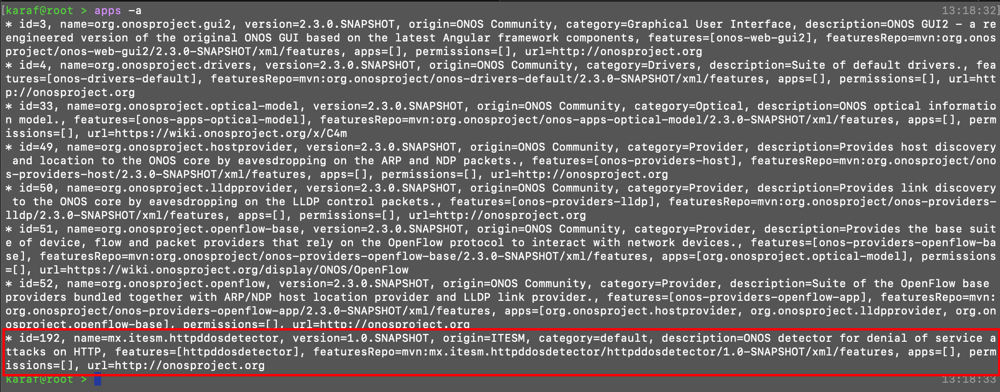
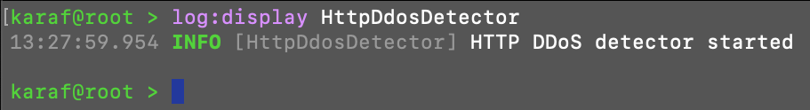
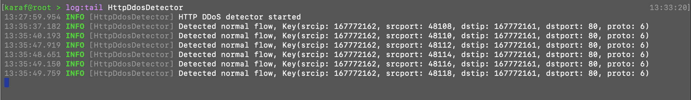

# Build an ONOS application

This tutorial will guide you through the development and installation of an ONOS application for the detection of HTTP DDOS attacks.

## Requirements:
- A running mininet VM

On mininet VM:
- Install maven http://javedmandary.blogspot.com/2016/09/install-maven-339-on-ubuntu.html
- Install jdk 11 https://www.oracle.com/technetwork/java/javase/downloads/jdk11-downloads-5066655.html http://ubuntuhandbook.org/index.php/2018/11/how-to-install-oracle-java-11-in-ubuntu-18-04-18-10/
- Download onos-admin https://wiki.onosproject.org/display/ONOS/ONOS+Remote+Admin+Tools. The download link is: https://drive.google.com/file/d/1E-OqKNFuzSa_iydN04tNKb7kz9ozAb7z/view (to decompress file use `tar xvzf archivo.tar.gz`)
- Install curl `sudo apt-get install curl`
- A running ONOS container, for more details on how to install it check this [guide](./INSTALL.md)

# Creating the project:

The fastest way to generate the scaffolding for the ONOS application will be by using the maven cli, with the following command `mvn archetype:generate -DarchetypeGroupId=org.onosproject -DarchetypeArtifactId=onos-bundle-archetype -DarchetypeVersion=2.2.1-b2` the archetype version might change overtime, you can check the current version on this link https://mvnrepository.com/artifact/org.onosproject/onos-archetypes. This command will download the required dependencies and promt you to set the following properties of the project.
- 'groupId': : mx.itesm.httpddosdetector           
- 'artifactId': : httpddosdetector
- Leave default for version and package, just click enter
- The app should be generated in the folder httpddosdetector

## Adding functionality to the app

There is a [repository](https://wiki.onosproject.org/display/ONOS/Building+the+ONOS+Sample+Apps) with several sample apps that you can use as a guide to create your own application depending on the functionality that you want to implement. You can also refer to the [Java ONOS api documentation](http://api.onosproject.org/1.15.0/apidocs/).

## Implementing HTTP DDoS detector

For the HTTP DDoS detector we will use a packet processor to analyze each flow and pass it through a machine learning algorithm to identify attack flows and later use the ONOS rest api to add flow rules to block the flows received by the attackers, in order to stop the attack.

For specific details on the implementation of the application please check the application repository [here](https://github.com/jatj/httpDetector/tree/master/src/main/java/mx/itesm/httpddosdetector).

# Running the ONOS application

## Installing the app

After your application is ready to be tested. You can compile the application into an ONOS Application Archive or .oar file by using the mvn cli with the following command `mvn clean install`.

Then you can use the .oar file to install it on the controller, we will use the onos-admin api, the one that you previously downloaded. Using the next command `<PATH_TO_ONOS_APP>/onos-app <ONOS_CONTROLLER_IP> install! <PATH_TO_OAR_FILE>`. 

Since we are using docker we will use container ip, on our setup the ONOS controller has the ip 172.17.0.1, if you have questions on how to setup the ONOS controller container check this [guide](./INSTALL.md). The OAR file is generated on the project root folder with the path `./target/httpddosdetector-1.0-SNAPSHOT.oar`. 

Here is an example of the complete installation command `../onos-admin-1.12.1-SNAPSHOT/onos-app 172.17.0.1 install! ./target/httpddosdetector-1.0-SNAPSHOT.oar`.

If you have previously installed the app and want to update it you will use the `reinstall!` command. Like so `../onos-admin-1.12.1-SNAPSHOT/onos-app 172.17.0.1 reinstall! ./target/httpddosdetector-1.0-SNAPSHOT.oar`

## Activating the app

Once you installed the app you need to activate the app in karaf cli. You need to SSH into karaf `ssh -p 8101 karaf@172.17.0.1`, the password is `karaf`. Then you can activate the app by running `app activate mx.itesm.httpddosdetector`. And now your application is installed and running on the controller.

To check if the application is activated you can run `apps -a` on the karaf cli. You should see the application id and package in the listed applications. 

You only have to activate the app once, even if you reinstall it. If you want to deactivate the app just run `app deactivate mx.itesm.httpddosdetector`.

# Debugging the ONOS application

On karaf cli you can display the logs with the following command `log:display`. 

You can also filter the logs to only display the ones that match with an specific tag. For example we can select only the logs from our application with the tag HttpDdosDetector:

So we can check if our application is properly running.

We can also continuosly display the log entries by using the `tail` command instead of the `display` so we can see in real time the logs. The filters also apply.

# References:
- [Creating and deploying an ONOS application](https://wiki.onosproject.org/display/ONOS/Creating+and+deploying+an+ONOS+application)
- [Creating and deploying an ONOS application video](https://www.youtube.com/watch?v=mzQubYhJhro)
- [Building the ONOS Sample Apps](https://wiki.onosproject.org/display/ONOS/Building+the+ONOS+Sample+Apps)
- [Template Application Tutorial](https://wiki.onosproject.org/display/ONOS/Template+Application+Tutorial)
- [Java ONOS api documentation](http://api.onosproject.org/1.15.0/apidocs/)