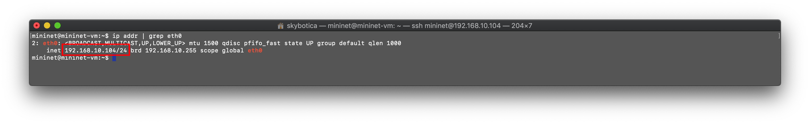
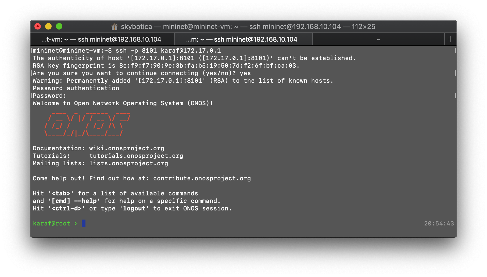
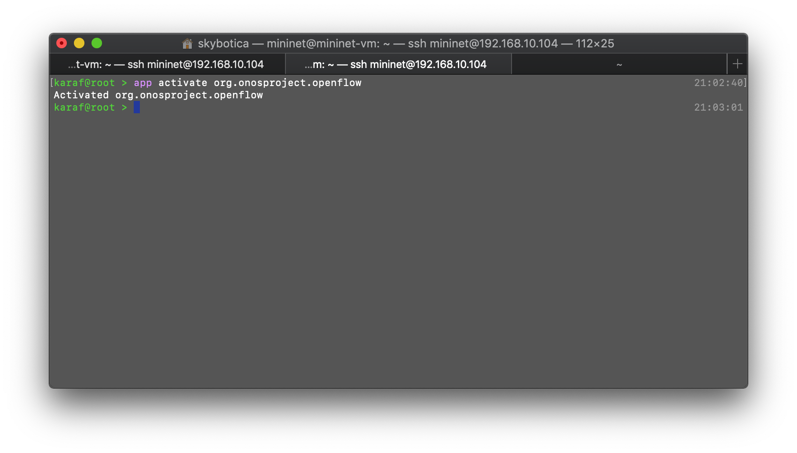
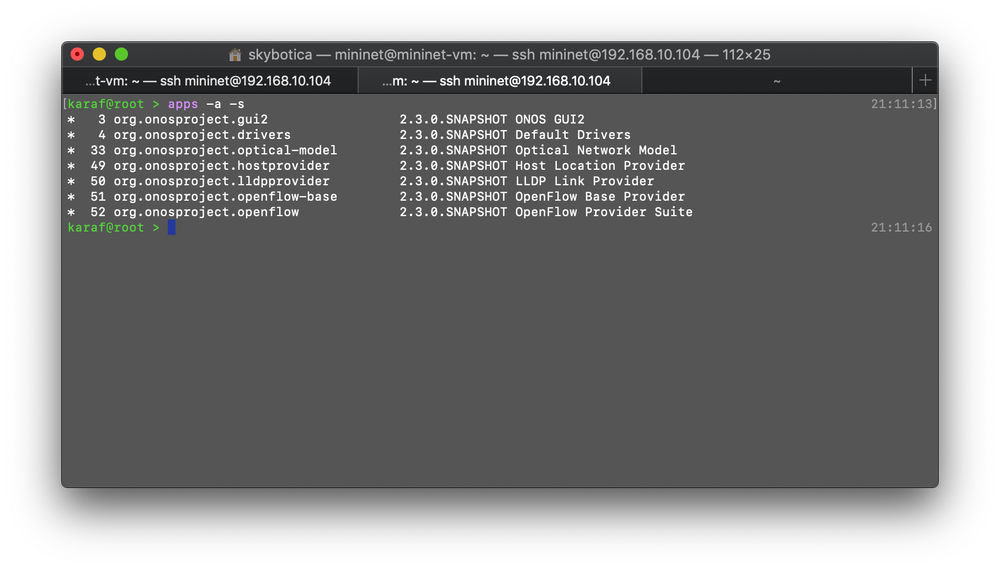
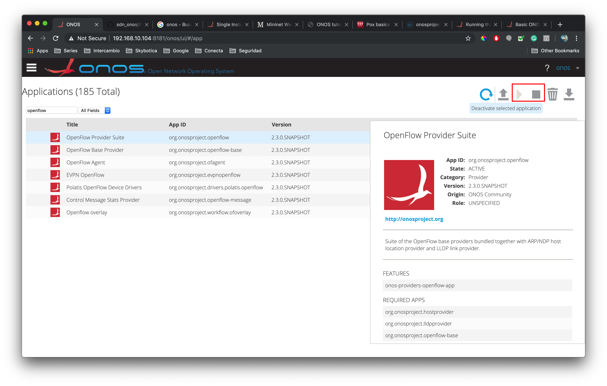
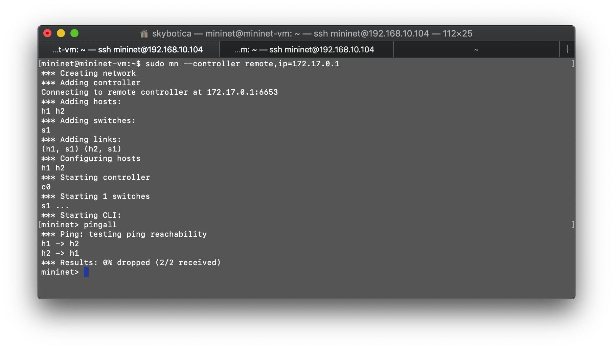
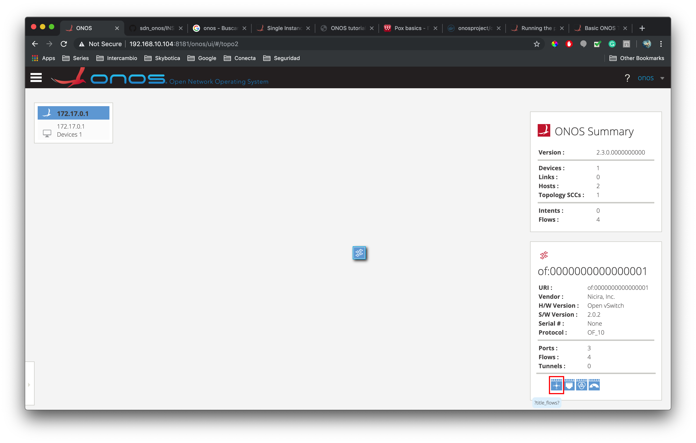

# Install ONOS

This tutorial will teach you how to properly install ONOS using Docker and you will also test it with a simple topology using mininet.

## Requirements
- An already configured mininet VM in virtual box (you can check the steps on the SDN wiki [here](http://sdn.wikidot.com/setting-up))
- The mininet VM should have access to internet

## Install Docker
Login to the mininet VM with a user with super user permissions and run the following commands to install docker.
1. `sudo apt-get update` Downloads the packages lists from the repositories
1. `sudo apt-get -y install docker.io` Install the docker.io package
1. `ln -sf /usr/bin/docker.io /usr/local/bin/docker` Creates a symlink from where the docker io package files where installed to the directory /usr/local/bin/docker, so a linux user can run the docker cli by just running `docker`.

## Run Docker image
- Download the onos image using  `sudo docker pull onosproject/onos`.

You can also use an specific release version with :VERSION_NUMBER, e.g. `sudo docker pull onosproject/onos:2.1.0`
- Run a single instance of ONOS
`sudo docker run -t -d -p 8181:8181 -p 8101:8101 -p 5005:5005 -p 830:830 --name onos onosproject/onos`

    The previous command is configured with the following options:
    1. -t will allocate a pseudo-tty to the container
    1. -d will run the container in foreground 
    1. -p <CONTAINER_PORT>:<HOST_PORT> Publish a CONTAINER_PORT to a HOST_PORT so. Some of the ports that ONOS uses:
        - 8181    for REST API and GUI
        - 8101    to access the ONOS CLI
        - 9876    for intra-cluster communication (communication between target machines)
        - 6653    for OpenFlow
        - 6640    for OVSDB
        - 830     for NETCONF 
        - 5005    for debugging, a java debugger can be attached to this port
    
    So with the previous command we are publishing the ONOS CLI, GUI, NETCONF, and Debugger ports.

To run a released version use the :VERSION_NUMBER again, e.g. `sudo docker run -t -d -p 8181:8181 -p 8101:8101 -p 5005:5005 -p 830:830 --name onos onosproject/onos:2.1.0`

- Ensure that the container is up and running `sudo docker ps`, you should see something like:

## Access Onos UI

After running the container the Onos UI should be accessible through the following url http://localhost:8181/onos/ui from mininet. We can check that ONOS is running and that the UI is accessible by running `wget -O - http://localhost:8181/onos/ui > /dev/null`, you should see something like:

However this is from the mininet terminal to see it on our browser we should access with mininet's IP, to know which IP is configured run `ip addr | grep eth0`. 

In our case it is the IP 192.168.10.104 thus we will access the UI with the this url http://192.168.10.104:8181/onos/ui. From there we will log in to the system, the default username is _onos_ and the password is _rocks_.

From there we will see the dashboard with the current topology of the system.

## Configure ONOS from cli
Since ONOS is running from a container, we will use ssh to access to the ONOS instance by running the following command `ssh -p 8101 karaf@<ONOS IP>`. We can get the IP from the UI it is the only device on the topology page and on our case it is 172.17.0.1 thus we will connect using `ssh -p 8101 karaf@172.17.0.1`. We will be prompted to access a password, which is **karaf**.

From there we can configure the controller, with the command `apps -s` we can list all the applications of the controller. We will now activate the open flow application by running `app activate org.onosproject.openflow`

We can check which are the activated applications by running `apps -s -a`, it will display only the active ones.

We can also manage the applications from the UI on the applications page. We can either activate or deactivate an application

## Configure mininet
Start a minimal topology on mininet `sudo mn --controller remote,ip=<ONOS IP>`, on our case it will be `sudo mn --controller remote,ip=172.17.0.1`. This will create a topology with 2 hosts (h1 and h2), one switch s1 and it will connect to the ONOS controller.

You can see that we tested a ping from h1 to h2 and also from h2 to h1 by running `pingall` from mininet cli. Which means that our ONOS controller is working.

## Visualize devices and flows on UI

If we enter to the topology page on the ONOS UI, we can now see that there is one device connected to the controller, in this case the switch s1.

We can also check the flows that this device has by selecting the flows icon

The flows are:

## References

- [Onos docker image](https://wiki.onosproject.org/display/ONOS/Single+Instance+Docker+deployment)
- [Onos cli from container](https://wiki.onosproject.org/pages/viewpage.action?pageId=3444271)