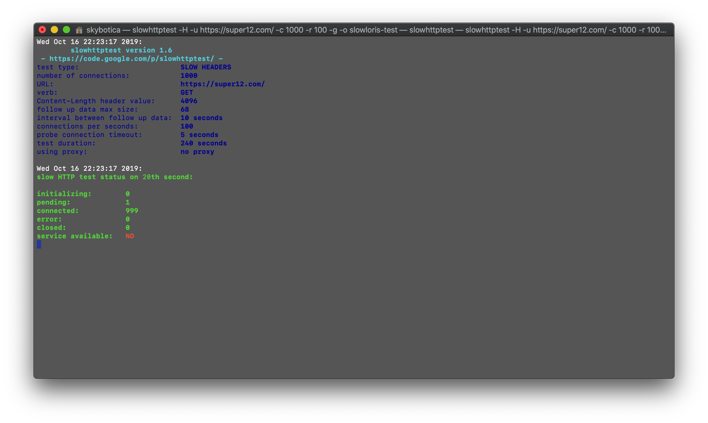
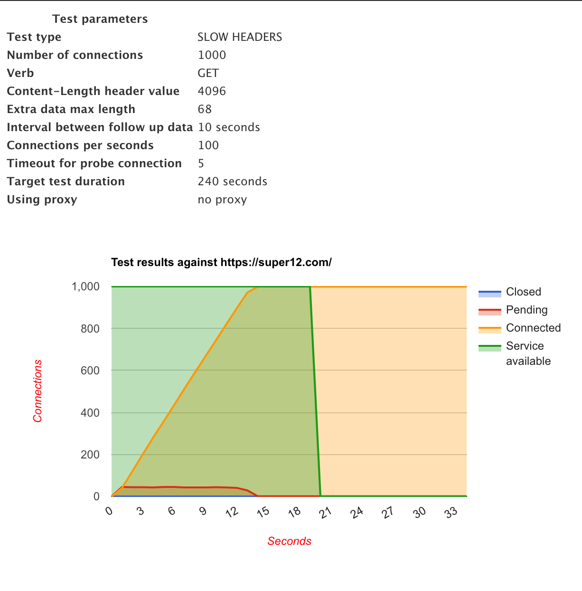
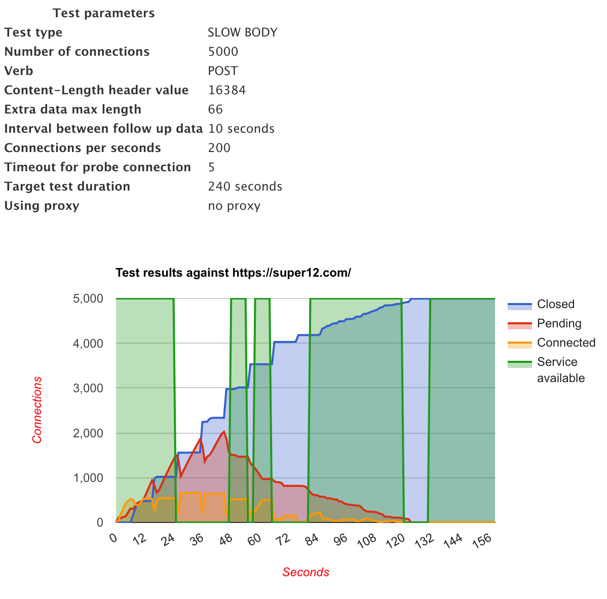
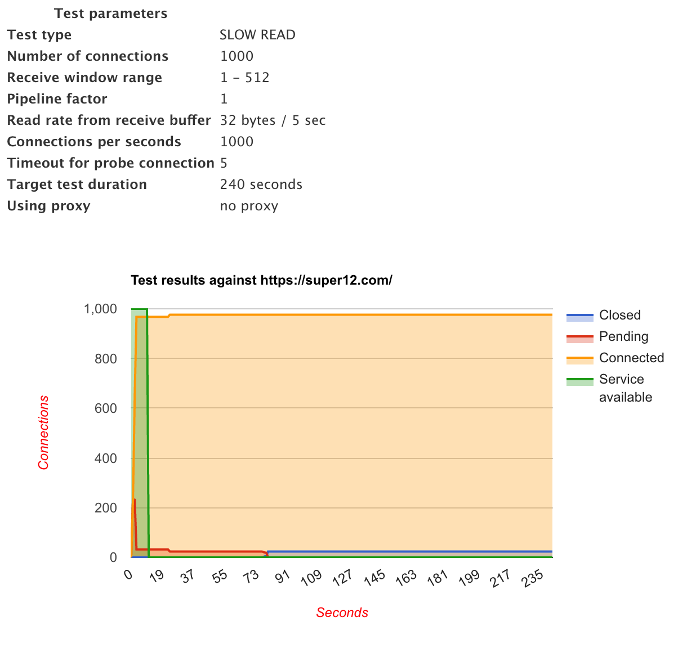

# Low and Slow HTTP Attacks

This tutorial will explain how the low and slow HTTP attacks work and also guide you through the usage 
of the attacks. 

This type of attacks are a type of denial of service attack that relies on small and low traffic to perform the attack, therefore they can be very hard to mitigate, because the traffic generated by the attacker seems to be normal traffic.

We will discuss three different attacks that lay on the low and slow HTTP attacks:

1. [Slowloris](#slowloris)
1. [Slow post](#slow%20post)
1. [Slow read](#slow%20read)

## Requirements:

- Previously install **slowhttptest**
- Basic knowledge of http 

# Slowhttptest basics

To test this type of attacks we will use the **slowhttptest** tool, for more information on how to install this tool, check the [http attacks tutorial](./HTTP_ATTACKS.md).

## Basic attack

To select the type of attack, within the three different attacks, we can use the following options:

- `-H` for Slowloris
- `-B` for slow post (RUDY)
- `-X` for slow read

**Note:** if we do not provide the type of attack to perform, **slowhttptest** uses Slowloris by default.

Besides selecting the type of attack we need to set the URL of the web server that we want to attack. We do that with the `-u <URL_TO_ATTACK>` option.

**Note:** if we do not provide the URL of the attack **slowhttptest** will use http://localhost/ as the url to attack.

If we put that together we can run a simple attack by running `slowhttptest <ATTACK_TYPE> -u <URL_TO_ATTACK>`, so a basic slow post attack would be `slowhttptest -B -u htttp://url.to.attack`.

## Configuring the request

We can modify the HTTP request that will be used in the attack by providing the following options:

- `-t <CUSTOM_VERB>`, custom HTTP verb to use in the request, POST, GET... (default is GET)
- `-f <CONTENT_TYPE>`, value of the Content-type header in the request
- `-m <ACCEPT_TYPE>`, value of the Accept header

We can also debug the process of the attack by setting up a different level of verbosity on the attack with the following option:

## Debugging the attack

If needed we can print the logs of the attack by setting a different level of verbosity with the option:

- `-v number`, verbosity level of log 0-4

## Analizing the attack

To further analize the attack, **slowhttptest** can generate statistics of the attack. We can enable them with the following options.

- `-g`, generate statistics in CSV and HTML of the attack
- `-o <OUTPUT_FILE_PATH>`, custom output file path and/or name of the generated statistics

**Note:** if we do not provide `-o` option with the output file path, **slowhttptest** will store the generated files with the following name `slow_<year>_<month>_<day>_<hours>_<minutes>_<seconds>.html` and `.csv`.

# Slowloris 

It is an application layer attack that uses partial HTTP requests to a web server 
and then it tries to keep them open as long as it can. This attack uses low 
bandwidth.

The flow of the attack is the following:
1. The attacker opens multiple connection to the server by sending partial HTTP request headers.
2. The server receives and opens a thread to handle the requests. It will wait to the connection to succeed or timeout before freeing the thread to handle another
request.
3. To prevent the server to timing out the connections, the attacker sends 
partial request periodically to keep the connection alive.
4. Once all available threads in the server are in use, the server will be unable to respond to additional requests from regular traffic (legitimate users).

## Attack configuration

If we are running a slowloris attack with **slowhttptest** we can configure the attack:

- `-c <CONNECTIONS>`, connections to be opened (limited to 65539, default is 50)
- `-r <CONNECTION_RATE>`, number connections opened per second (default is 50)
- `-i <SECONDS>`, the interval in seconds between follow up data in seconds, per connection (default is 10)
- `-l <SECONDS>`, duration of the attack (how long it will keep attacking) in seconds (default is 240s)
- `-p <SECONDS>`, seconds to wait for HTTP response on probe connection, to determine if the server is considered as inaccesible (default is 5s)
- `-x <BYTES>`, max length of the follow up data in bytes (default is 32 bytes)

## Attacking with slowloris

If we want to attack the site https://super12.com/ with slowloris, 1000 connections at a rate of 100 connections per second, and generate the attack statistics with the _slowloris-test_ name, we would run the following command: `slowhttptest -H -u https://super12.com/ -c 1000 -r 100 -g -o slowloris-test`. 

After running it we will see something like this on our terminal:

It will start the attack and every 5 seconds it will update the status of the attack. Around the 20th second the attack will be successful and we shouldn't be able to reach the website. 

After some time the connections will begin to be closed by the server so eventually the server will be available again. We can wait to finish the test in 240 seconds (the default testing time) or we can just kill the process on our terminal with ctrl+c.

## Analizing slowloris

After finishing the test will generate a .csv and a .html with the statistics of the attack. The generated html should look like this:

# Slow post 

Slow post or R-U-Dead-Yet (RUDY) is another application layer attack and in a difference from slowloris it uses legitimate HTTP POST headers to attack, however the message body is sent at a very low speed, which can be as slow as one byte every two minutes. 

Similar to slowloris the server will keep the attacker requests open waiting to receive the full message body, which will eventually consume all the server resources, making legitimate connections unachievable.

## Attacking with slow post

Some of the attack options are the same for slowloris, for more information on those options you can check the [attack configuration](#attack%20configuration) section above. 

Besides the previous options, with slow post we can also use the next option:

- `-s <BYTES>`, the value of Content-Length header (default is 4096)

If we want to attack the site https://super12.com/, using slow post, with 5000 connections at a rate of 100 connections per second, with a content length of 16384 and generate the attack statistics with the _slowpost-test_ name, we would run the following command: `slowhttptest -B -u https://super12.com/ -c 5000 -r 100 -s 16384 -g -o slowpost-test`.

## Analizing slow post

After running the test we can analize the generated html to check that the server reacted different from the slowloris attack.

With this type of attack the server was able to close several attack connections quicker than with slowloris. So the test results show an smaller gap of time when the server wasn't responding to legitimate connections, even though we run this attack with 5 times the number of connections used by the slowloris example.

# Slow read

The last type of slow HTTP attack that we will look into. It consists in sending inappropiate HTTP request to the server, but read the response at a slow pace. 

The response can be readed as slow as one byte at a time, the attacker prevent the server to timeout the connection, because the server assumes the attacker is reading the data therefore it keeps the connection alive. 

## Attacking with slow read

Some of the attack options are the same for slowloris, for more information on those options you can check the [attack configuration](#attack%20configuration) section above. 

Besides the previous options, with slow read we can also use the following options:

- `-z <BYTES>` bytes to read from receive buffer with single read() operation
- `-n <SECONDS>` interval between read operations from receive buffer
- `-w <BYTES>` start of range the advertised window size would be picked from
- `-y <BYTES>` end of range the advertised window size would be picked from

So if we want to attack the site https://super12.com/, using slow read with 1000 connections, since it is slow read we want to create all connections at once so the connection rate will be 1000 also, with a 5 second interval between read operations, 32 bytes to read from the receive buffer per read operation and generate the attack statistics with the _slowread-test_ name, we would run the following command: `slowhttptest -X -u https://super12.com/ -c 1000 -r 1000 -n 5 -z 32 -g -o slowread-test`.

## Analizing slow read

After running the test we can see that unlike the slow post attack, slow read keeps the server down for a while. Even after the attack is ended the server takes time to recover from the attack. Below are the statistics of the slow read attack.

# References:

## Documentation:
- [Low and slow attacks](https://www.cloudflare.com/learning/ddos/ddos-low-and-slow-attack/)
- [Slowloris 1](https://www.netscout.com/what-is-ddos/slowloris-attacks)
- [Slowloris 2](https://www.cloudflare.com/learning/ddos/ddos-attack-tools/slowloris/)
- [Slow post](https://www.netscout.com/what-is-ddos/slow-post-attacks)
- [Slow read](https://es.netscout.com/what-is-ddos/slow-read-attacks)
- [Slowhttptest installation and usage](https://github.com/shekyan/slowhttptest/wiki/InstallationAndUsage)

## Other repos
- [Pcap parser](https://github.com/jatj/pcapParser)
- [Random forest classifier for HTTP DDoS attacks](https://github.com/jatj/random_forest_http_attacks)
- [HttpDdosDetector application](https://github.com/jatj/httpDetector)