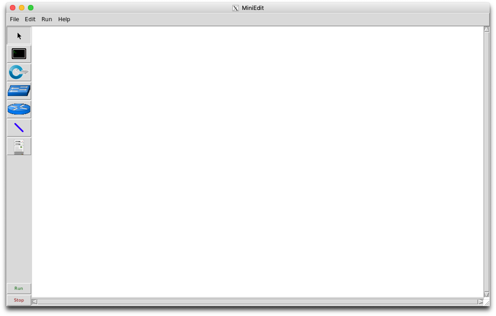
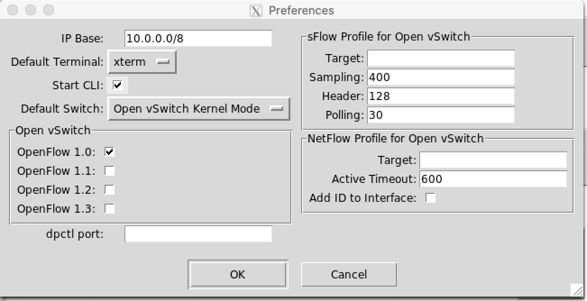
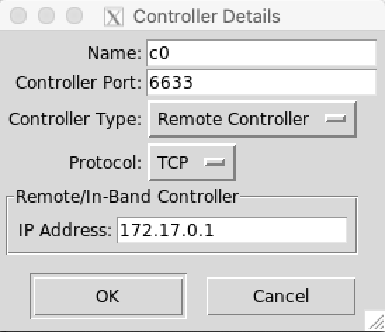
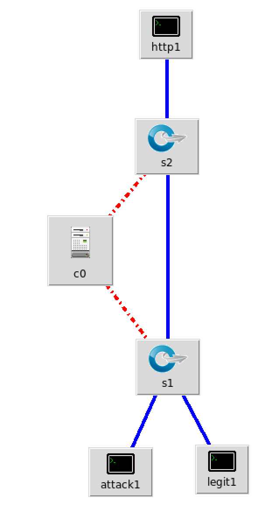
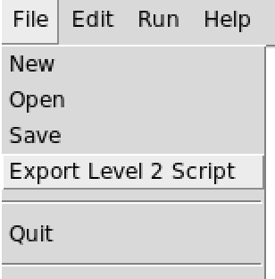
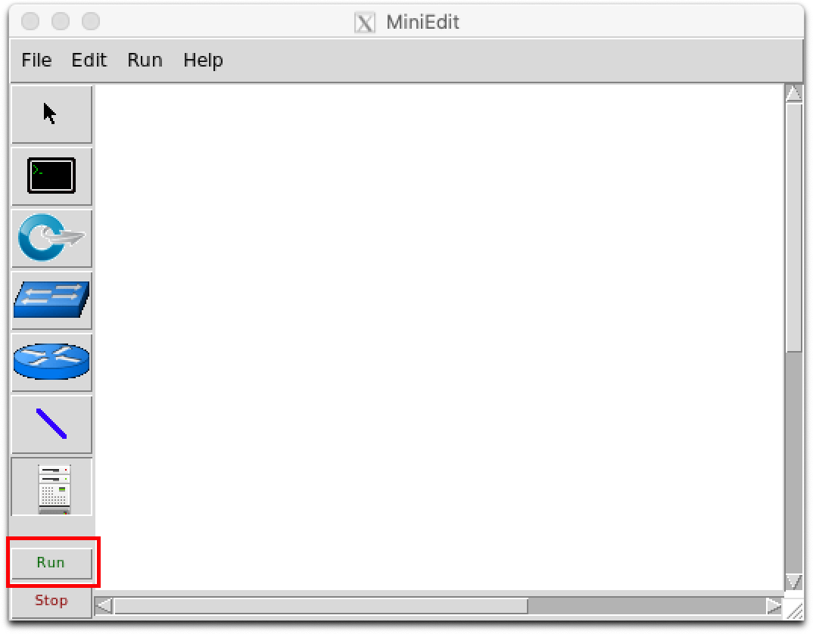

# Custom topologies on mininet

This tutorial will explain how to create, edit and run custom topologies on mininet with ONOS as the SDN controller.

## Requirements

- An already configured mininet VM in virtual box (you can check the steps on the SDN wiki [here](http://sdn.wikidot.com/setting-up))
- ONOS controller running, if you haven't installed it yet you can check our previous tutorial [here](./INSTALL.md).
- Basic knowledge of http 

## Create/edit topologies with mininet editor

Mininet provides a GUI MiniEdit that allow us to create and edit new topologies. To enable mininet to open MiniEdit, you have to ssh into mininet vm, if you are using Mac To open this GUI use the following command `sudo ~/mininet/examples/miniedit.py`. You should see something like:

It has an intuitive interface, you can add switches, legacy switches, routers, hosts and controllers to the topology. Once you have configured the topology just click file>save to save the .mn file, which can be used to load the topology again. 

### Topology preferences

You can set the topology preferences on Edit>Preferences. If you want to run mininet within the editor you need to check the start cli checkbox, like so:

On this window you can also change the open flow version and the IP base of the topology.

### Configure controller

Once you added a controler if you are using ONOS you must set it as a remote controller and set the ONOS controller ip (172.17.0.1 on our installation), you can do that by right clicking on the controller and click on properties. You will see the following window:

### Set ips 

Once you added your hosts you can setup their ip and more options by right clicking on it and click properties. 

### Example

Below is an example of a simple topology with 2 switches one server and 2 hosts.

You can find the .mn [here](./res/topologies/1server_1net_2hosts.mn)

### Export

Once you want to test it generate the .py to run the topology by pressing file>export level 2 script. 

## Run topology

You can run a custom topology in two different ways:

### Run from MiniEdit

To run the topology from MiniEdit just open it and click on run, like so:

### Run exported .py
After exporting your topology to a .py, you can run the topology with the command `sudo ./path/to/topology.py`. You can test the connectivity of the hosts by using the command `pingall`.
